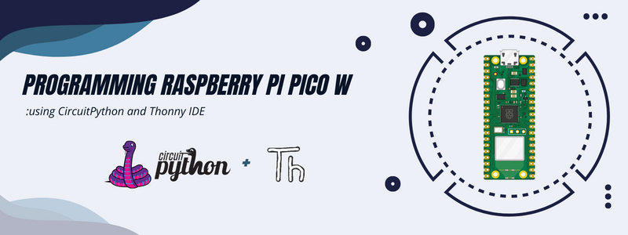

  

<h1 align="center">
📦 Automated Parcel Storage and Collection System
</h1>

An IoT-enabled embedded system for automated parcel delivery, storage, and secure collection using dual Raspberry Pi Pico microcontrollers.

---

## 📖 Project Overview

The **Automated Parcel Storage and Collection System** is an embedded systems project developed to automate the complete parcel delivery, storage, and collection process within a university environment. The system combines **embedded control**, **IoT connectivity**, and **secure user authentication** to provide an efficient and reliable alternative to conventional manual parcel management.

The project is built around **two Raspberry Pi Pico microcontrollers** working cooperatively. The first controller manages parcel delivery, while the second controller handles parcel storage, secure collection, and IoT services. Communication between both controllers is achieved through **UART communication** and a dedicated **GPIO storage status signal**, enabling reliable synchronization throughout the system.

In addition to hardware automation, the system integrates a **Telegram Bot** that provides real-time parcel notifications, collection PIN delivery, security alerts, and multilingual user support, making the parcel collection process convenient, secure, and fully automated.

---

#  Core Features

| Feature | Description |
|:--------:|-------------|
| 📦 **Automated Parcel Delivery** | Automatically validates student IDs, opens the delivery gate, and transports parcels to the storage section. |
| 📡 **Laser–LDR Detection** | Detects parcel placement by monitoring the interruption of the laser beam and initiates conveyor movement automatically. |
| 🔄 **Smart Storage Management** | Stores parcels sequentially across the Ground, First, and Second floors while tracking storage availability. |
| 🔐 **Secure PIN Authentication** | Generates a unique 4-digit PIN for each parcel, ensuring that only authorized students can collect their parcels. |
| 🚪 **Automatic Parcel Collection** | Opens the appropriate collection door for 7 seconds after successful PIN verification. |
| 📤 **Automatic Parcel Shifting** | Remaining parcels are automatically shifted downward after collection to maximize storage efficiency. |
| 📲 **Telegram Bot Integration** | Sends parcel arrival notifications, collection confirmations, reminders, and security alerts in real time. |
| 🔗 **Dual Pico Communication** | Raspberry Pi Pico boards communicate through one-way UART and a dedicated GPIO storage status signal. |
| 🚨 **Security Alarm System** | Activates an audible alarm after three consecutive incorrect PIN attempts. |
| 🌐 **Multi-language Support** | Telegram Bot interface supports multiple languages for improved user accessibility. |

---

# 🔧 Hardware Components

The Automated Parcel Storage and Collection System integrates multiple electronic components to automate parcel delivery, storage, collection, and user interaction.

| Component | Quantity | Purpose |
|-----------|:--------:|---------|
| Raspberry Pi Pico | 1 | Controls the parcel delivery subsystem |
| Raspberry Pi Pico W | 1 | Controls parcel storage, collection, and IoT services |
| 4×4 Matrix Keypad | 2 | Student ID and PIN entry |
| Grove RGB LCD Display | 1 | User interface for the delivery subsystem |
| 16×2 I²C LCD Display | 1 | User interface for the storage and collection subsystem |
| Continuous Rotation Servo Motors | 6 | Delivery gate, storage gates, collection doors, and parcel shifting mechanism |
| 28BYJ-48 Stepper Motors | 2 | Conveyor belt and storage shifting mechanism |
| ULN2003 Driver Modules | 2 | Stepper motor drivers |
| Laser Module | 1 | Parcel detection |
| LDR Sensor | 1 | Detects interruption of the laser beam |
| Passive Buzzer | 1 | Security alarm |
| LEDs | 2 | Security status indicators |

---

# 💻 Software Design

The software was developed using **CircuitPython** and follows an **Object-Oriented Programming (OOP)** architecture to improve modularity, readability, and maintainability.

The project is divided into two independent software subsystems:

### 📦 Delivery Controller (Pico 1)

Responsible for:

- Student ID verification
- Delivery gate control
- Laser-LDR parcel detection
- Conveyor control
- UART communication with Pico 2

### 📥 Storage & Collection Controller (Pico 2)

Responsible for:

- Parcel storage management
- Random PIN generation
- Parcel collection
- Automatic parcel shifting
- Telegram Bot integration
- Security alarm system
- Wi-Fi connectivity
- UART communication with Pico 1

> **Note:** The complete source code for both controllers is available within the `Pico1` and `Pico2` directories of this repository.

---

# 🔄 System Flowcharts

The operational logic of the Automated Parcel Storage and Collection System is implemented using two independent controllers. The following flowcharts illustrate the execution flow of both Raspberry Pi Pico microcontrollers throughout the parcel delivery, storage, and collection processes.

## 📦 Pico 1 – Delivery Controller

    

<b>Figure 2.</b> Operational flow of the delivery subsystem executed by Raspberry Pi Pico.

---

## 📥 Pico 2 – Storage & Collection Controller

    

<b>Figure 3.</b> Operational flow of the storage and collection subsystem executed by Raspberry Pi Pico W.

---

# 🔌 Electronic Schematic

The complete electronic schematic illustrates the interconnection between the Raspberry Pi Pico microcontrollers and the peripheral devices used throughout the system. It includes the delivery subsystem, storage and collection subsystem, communication interfaces, sensors, actuators, and user interface components.

    

<b>Figure 4.</b> Complete electronic schematic of the Automated Parcel Storage and Collection System.

---

# 🔗 Controller Communication

The system employs two communication methods to synchronize both embedded controllers efficiently.

| Communication | Description |
|---------------|-------------|
| **UART (One-Way)** | Transfers the validated Student ID from the delivery controller (Pico 1) to the storage controller (Pico 2) after successful parcel delivery. |
| **GPIO Status Signal** | Indicates storage availability. A HIGH signal allows new deliveries, while a LOW signal prevents additional deliveries when all storage compartments are occupied. |

This communication strategy minimizes software complexity while ensuring reliable synchronization between both controllers.
